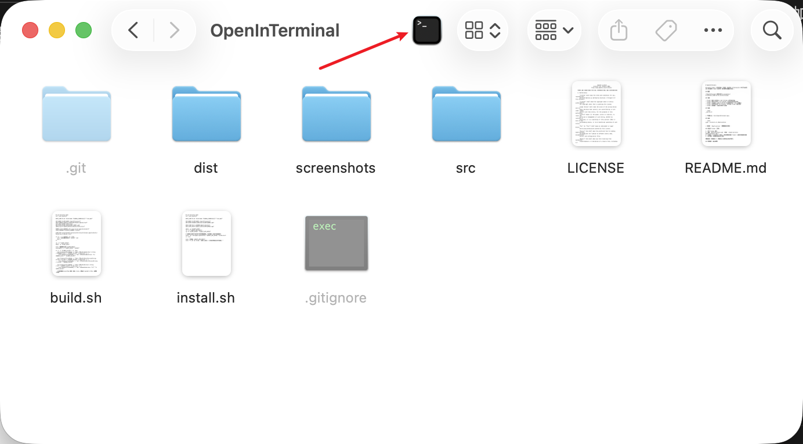

# OpenInTerminal

在 macOS Finder 工具栏添加一个按钮，点击后在 **Terminal** 中打开当前目录（优先使用 Finder 选中项，其次使用当前窗口目录）。

## 解决痛点

作为开发者，你是否经常遇到以下场景：

- 🔍 **在 Finder 中浏览项目目录**，想要在 Terminal 中打开该目录进行操作
- 📋 **手动复制路径**，切换到 Terminal，输入 `cd` 命令，粘贴路径（路径可能很长，容易出错）
- 🔄 **频繁切换应用**：Finder → Terminal → 输入路径，操作繁琐
- 📁 **处理多个目录**：需要在 Terminal 中打开多个不同的文件夹，每次都要重复上述步骤
- ⏱️ **浪费时间**：简单的一个操作需要多个步骤才能完成

**OpenInTerminal** 解决了这些问题：
- ✅ **一键直达**：在 Finder 工具栏点击按钮，立即在 Terminal 中打开当前目录
- ✅ **智能识别**：自动识别选中的文件夹、文件或当前窗口目录
- ✅ **批量处理**：支持多选，自动在多个 Terminal Tab 中打开不同目录
- ✅ **零配置**：安装后拖到工具栏即可使用，无需额外设置

## 截图



## 功能

- Finder 选中**文件夹**：在 Terminal 打开该文件夹
- Finder 选中**文件**：在 Terminal 打开该文件所在文件夹
- Finder **多选**：会在 Terminal 中分别打开多个 Tab（去重后）
- Finder 未选中任何项：在 Terminal 打开当前 Finder 窗口目录
- Finder 没有窗口：回退打开用户主目录

## 构建

```bash
./build.sh
```

> 产物默认在 `dist/OpenInTerminal.app`。

## 安装

```bash
sudo ./install.sh /Applications
```

> 安装到 `/Applications`（需要管理员权限）：

## 添加到 Finder 工具栏

1. 打开 Finder 窗口
2. 找到 `OpenInTerminal.app`（例如 `~/Applications/OpenInTerminal.app`）
3. **按住 ⌘（Command）不放**，把应用图标拖到 Finder 工具栏你希望的位置
4. 松开鼠标，按钮即会固定到工具栏

移除按钮：同样按住 ⌘，把按钮从工具栏拖出来松开即可。

## 权限提示（首次使用）

该工具需要通过自动化控制 Finder/Terminal 来读取路径并执行 `cd`，首次点击会弹出权限请求。

如被拒绝或未弹窗，可在：

- 系统设置 → 隐私与安全 → 自动化（Automation）

允许 `OpenInTerminal` 控制：

- Finder
  
> 说明：当前打开 Terminal 使用的是 `open -a Terminal <path>`，不依赖 `tell application "Terminal"`；Finder 的自动化权限用于读取“当前窗口/选中项路径”。如果系统弹出“控制系统事件（System Events）”也需要允许。

## 常见问题

### 点击工具栏按钮没反应

按以下顺序排查：

1. **先移除再重新添加按钮**：按住 `⌘` 把工具栏按钮拖出移除，再从 `~/Applications/OpenInTerminal.app` 重新拖入（避免工具栏绑定到旧的/已被替换的 app）。
2. **确认 app 位置稳定**：建议把 app 放在 `~/Applications` 或 `/Applications`，不要直接用 `dist/` 里的临时构建产物作为工具栏按钮。
3. **检查自动化权限**：系统设置 → 隐私与安全 → 自动化，允许 `OpenInTerminal` 控制 Finder。
4. **重置自动化权限（曾经点过“拒绝”时）**：执行 `tccutil reset AppleEvents com.vvicat.openinterminal`，然后重新点击按钮触发授权弹窗。

### 开启/查看调试日志

默认会写入日志到：

- `/tmp/OpenInTerminal.log`

清空日志：

```bash
rm -f /tmp/OpenInTerminal.log
```

点一次工具栏按钮后查看：

```bash
tail -n 200 /tmp/OpenInTerminal.log
```

## 自定义

- 如需自定义图标：把你的 `.icns` 覆盖到 `dist/OpenInTerminal.app/Contents/Resources/applet.icns`，然后执行 `touch dist/OpenInTerminal.app`。
- 如需改默认行为（例如只打开一个 Tab）：修改 `src/OpenInTerminal.applescript` 后重新执行 `./build.sh`。
